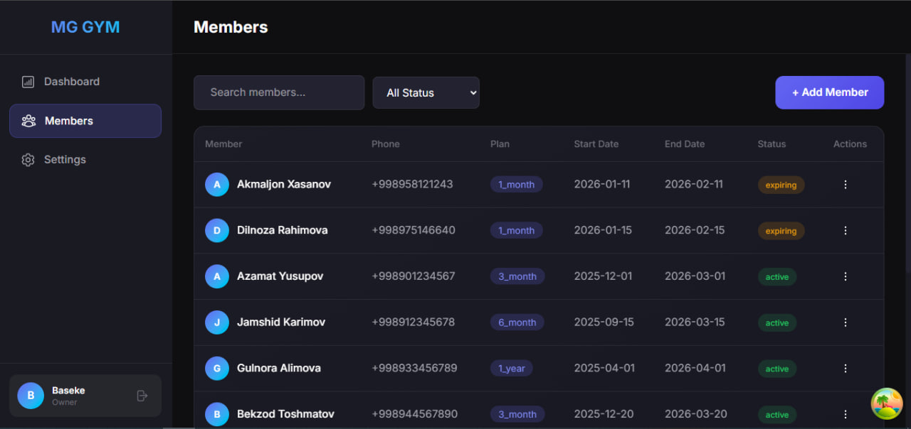
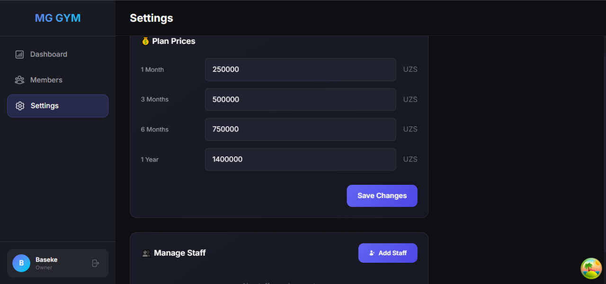

# 🏋️ MG-Gym Admin Panel

A modern gym membership management system built for small local gyms. Replaces paper-based member tracking with a clean, efficient digital solution.

## ✨ Features

- **Member Management** - Add, edit, renew, and delete gym members
- **Smart Status Tracking** - Automatic status calculation (Active, Expiring Soon, Expired)
- **Dashboard Overview** - Quick stats and expiring members alerts
- **Search & Filter** - Find members by name or filter by status
- **Server-side Pagination** - Efficient data loading for large member lists
- **Staff Management** - Owner can add/remove staff accounts
- **Plan Pricing** - Configurable membership plan prices
- **Role-based Access** - Owner and Staff roles with different permissions

## 🛠️ Tech Stack

- **Frontend:** React 19 + Vite
- **Styling:** Tailwind CSS 4
- **State Management:** TanStack React Query
- **Forms:** React Hook Form
- **Routing:** React Router DOM 7
- **Backend:** Supabase (Database, Auth, Edge Functions)
- **Notifications:** React Hot Toast

## 📁 Project Structure

```
src/
├── features/           # Feature-based modules
│   ├── authentication/ # Login, logout, user hooks
│   ├── dashboard/      # Dashboard stats and widgets
│   ├── members/        # Member CRUD operations
│   └── settings/       # Plan prices, staff management
├── helpers/            # Utility functions and constants
├── hooks/              # Shared custom hooks
├── pages/              # Route page components
├── services/           # Supabase API functions
└── ui/                 # Reusable UI components
```

## 🚀 Getting Started

### Prerequisites

- Node.js 18+
- A Supabase account

### 1. Clone the repository

```bash
git clone https://github.com/yourusername/mg-gym.git
cd mg-gym
```

### 2. Install dependencies

```bash
npm install
```

### 3. Set up Supabase

Create a new Supabase project and set up the following tables:

**members**
| Column | Type |
|--------|------|
| id | uuid (primary key) |
| fullName | text |
| phone | text |
| planType | text |
| startDate | date |
| endDate | date |
| created_at | timestamp |

**profiles**
| Column | Type |
|--------|------|
| id | uuid (references auth.users) |
| email | text |
| fullName | text |
| role | text ('owner' or 'staff') |
| created_at | timestamp |

**settings**
| Column | Type |
|--------|------|
| id | uuid (primary key) |
| key | text |
| value | text |
| updated_at | timestamp |

### 4. Configure environment variables

Create a `.env` file in the root directory:

```env
VITE_SUPABASE_URL=your_supabase_project_url
VITE_SUPABASE_ANON_KEY=your_supabase_anon_key
```

### 5. Run the development server

```bash
npm run dev
```

Open [http://localhost:5173](http://localhost:5173) in your browser.

## 📝 Available Scripts

| Command           | Description              |
| ----------------- | ------------------------ |
| `npm run dev`     | Start development server |
| `npm run build`   | Build for production     |
| `npm run preview` | Preview production build |
| `npm run lint`    | Run ESLint               |

## 🔐 Authentication

The app uses Supabase Auth with email/password authentication. There are two roles:

- **Owner** - Full access including staff management
- **Staff** - Can manage members but cannot modify staff or see sensitive settings

## 🎨 UI Components

The app includes reusable UI components:

- `Modal` - Compound component pattern for dialogs
- `Menus` - Context menu with positioning
- `Pagination` - Page navigation with prefetching
- `FilterSelect` - Status filter dropdown
- `SearchInput` - Debounced search input
- `StatCard` - Dashboard statistics cards

## 📱 Screenshots





## 🤝 Contributing

This is a personal project built for a local gym business.

## 📄 License

MIT License

---

Built with ❤️ by Atachi (Atabek)
